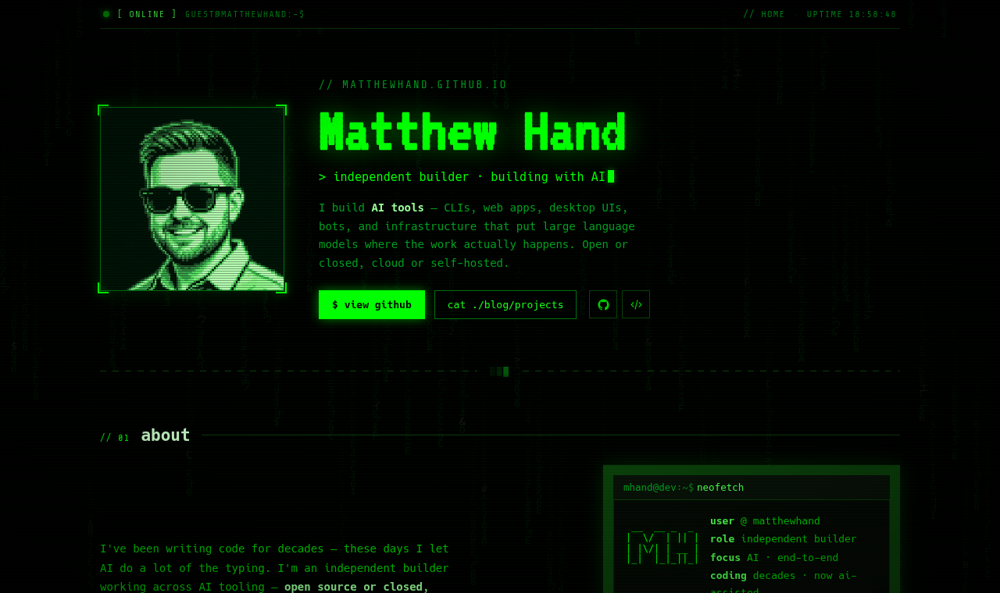
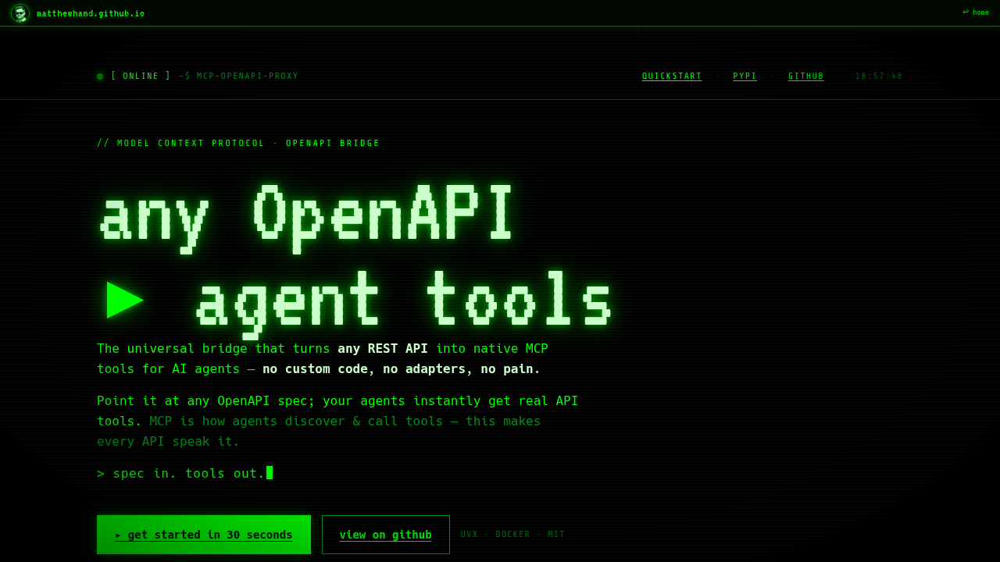
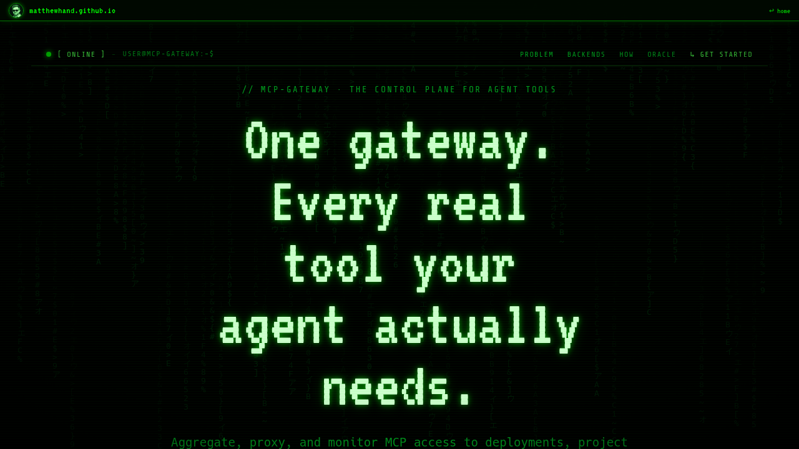
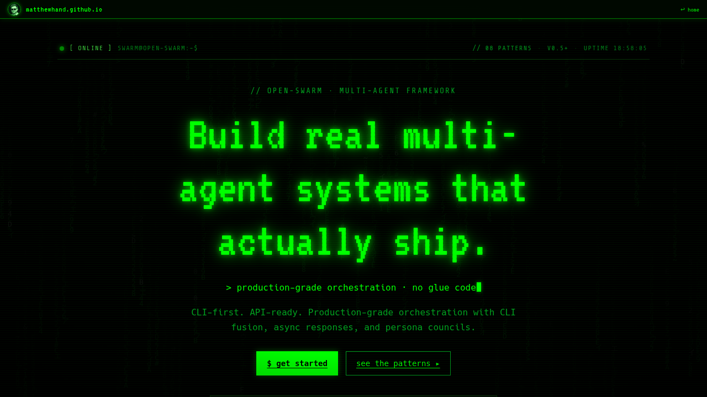
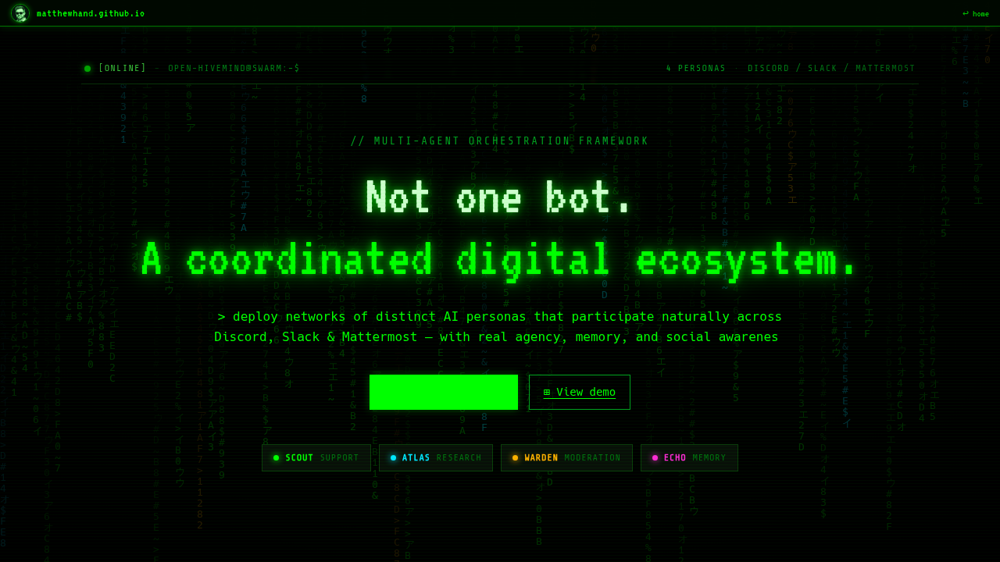
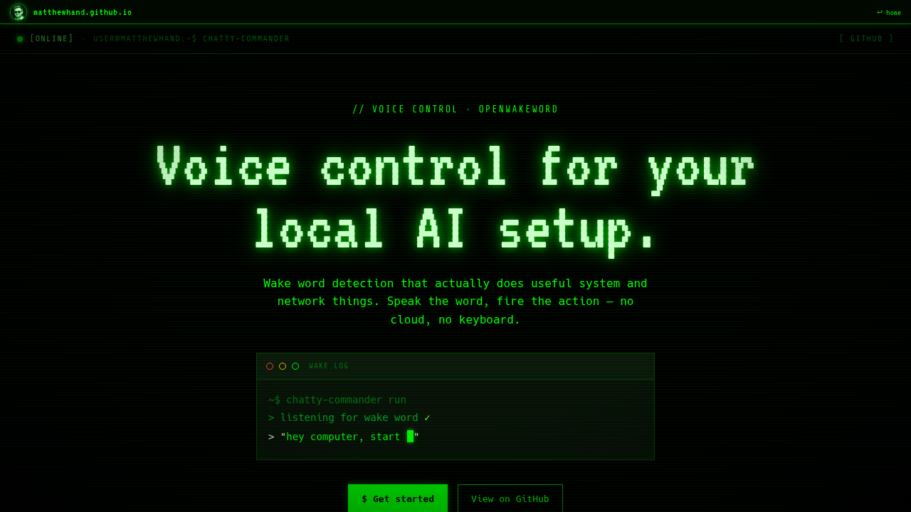

# matthewhand.github.io

Matthew Hand's personal homepage and project showcase — a green-phosphor / CRT-terminal
themed static site hosted on GitHub Pages.

**Live:** https://matthewhand.github.io

Each page is a self-contained HTML file (no build step, no server) styled as a retro
terminal: boot sequence, matrix-rain backdrop, scanline overlay, and monospace phosphor
type. The homepage links to a detail page for each project.

---

## Pages

### Home — `index.html`
Landing page: intro, tech stack, and a project grid. Each project card opens its detail
page in the same tab; every detail page has a top bar that links back here.

### mcp-openapi-proxy — `mcp-openapi-proxy.html`
Turns any OpenAPI spec into native MCP tools for AI agents.

### mcp-gateway — `mcp-gateway.html`
One authenticated control plane in front of all your MCP servers.

### open-swarm — `open-swarm.html`
Build real multi-agent systems as code — run as a CLI or an OpenAI-compatible API.

### open-hivemind — `open-hivemind.html`
One coordinated multi-agent brain behind many bots (Discord / Slack / Mattermost).

### chatty-commander — `chatty-commander.html`
Voice control for your local AI setup, powered by openWakeWord.

---

## Structure

| Path | Purpose |
|------|---------|
| `index.html` | Homepage (self-unpacking React bundle) |
| `*.html` (5 project pages) | Per-project detail pages |
| `404.html` | Themed not-found page |
| `avatar.png` | Profile portrait used in the hero + nav bars |
| `favicon.svg` / `favicon-32.png` / `favicon.ico` / `apple-touch-icon.png` | Site icons |
| `og-card.png` | 1200×630 Open Graph / Twitter share card |
| `robots.txt` / `sitemap.xml` | Search-engine hints |
| `assets/` | Stub files satisfying vestigial bundle references |
| `docs/screenshots/` | Screenshots used in this guide |

## Quality bar

Verified across Chromium, Firefox, and WebKit; responsive from 320px to 1920px with no
horizontal overflow; zero console errors / failed requests on the live site; honors
`prefers-reduced-motion`; text meets WCAG AA contrast; Open Graph share cards on every page.

## Maintenance notes

- The HTML pages are **self-unpacking bundles** (gzip+base64 modules inside
  `` tags don't break the container.
- Re-exporting a page from the design tool **wipes injected fixes** (the `<style>`/`<meta>`
  blocks for overflow, contrast, reduced-motion, favicon, OG, nav). Re-apply after any
  re-export.
- The screenshots in this guide are regenerated with headless Chromium
  (see `docs/screenshots/`).

🤖 Guide and screenshots maintained with [Claude Code](https://claude.com/claude-code)
